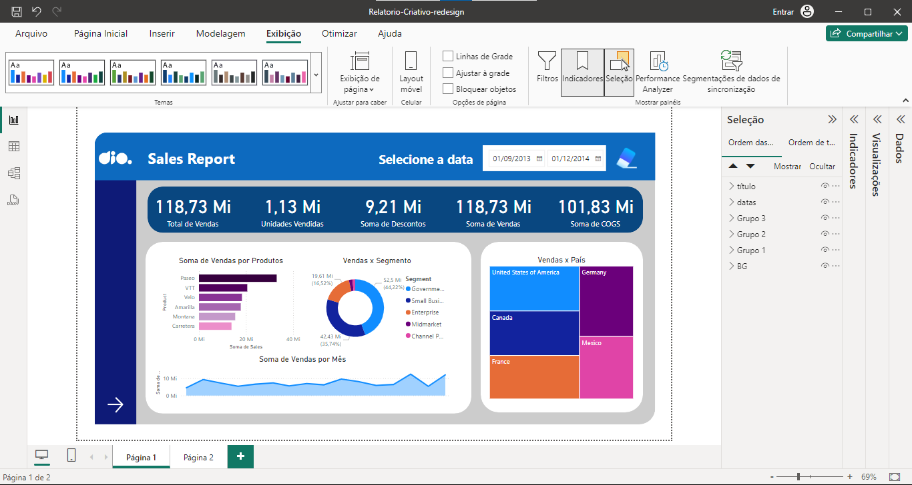
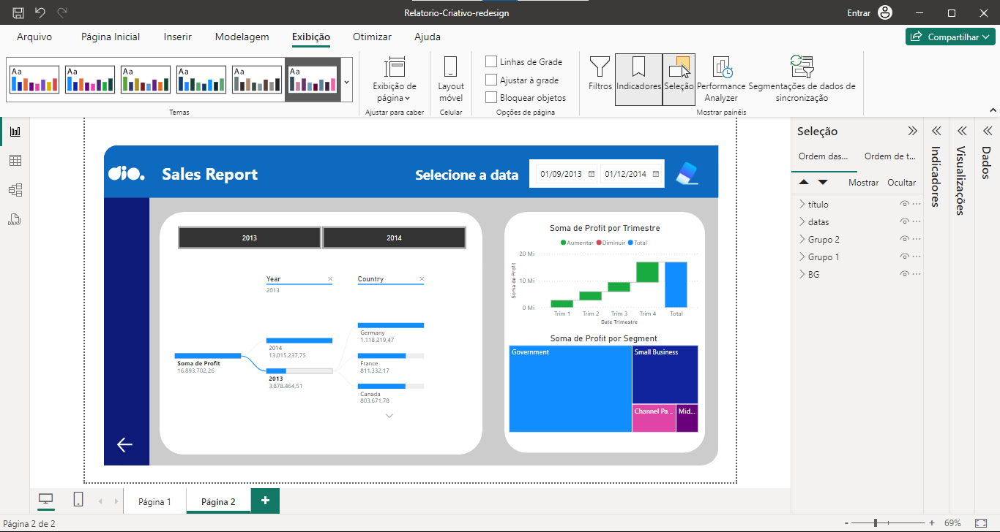
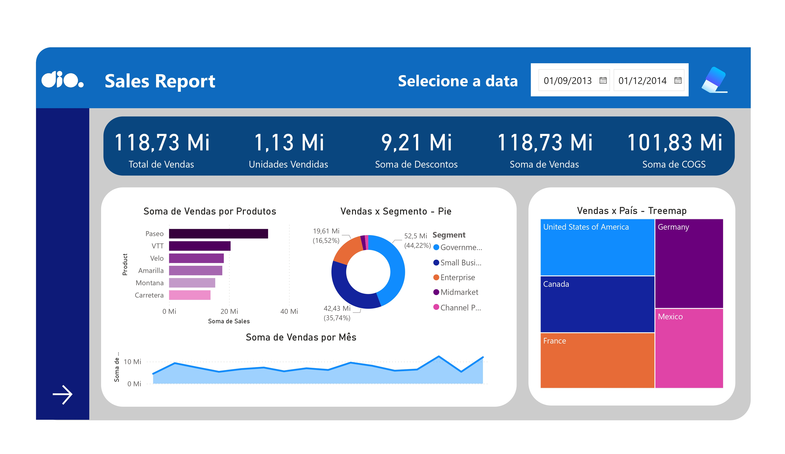
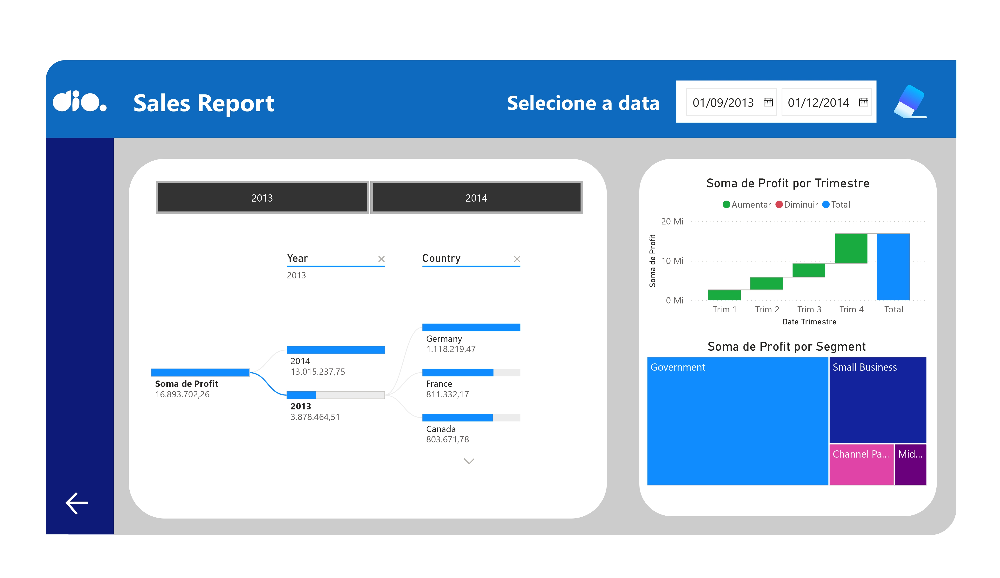

# NTT-DATA Desafio: Managerial-Dashboard-Design-Enhancement

### Sobre o projeto

Este desafio faz parte do **bootcamp NTT-Data** e tem como objetivo aprimorar o design de um relatório previamente desenvolvido. Utilizando técnicas de **UX/UI**, apliquei princípios da **proporção áurea** e as **leis da Gestalt**, com foco na **diagramação e na experiência do usuário**. O projeto teve como base o design de um relatório anterior, que foi revisado e melhorado para proporcionar uma interface mais intuitiva e visualmente equilibrada, aproveitando meu conhecimento em design.

### Resultado

