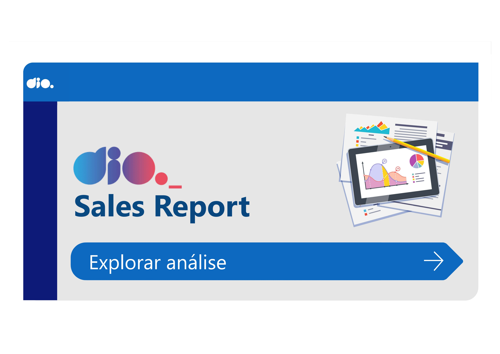
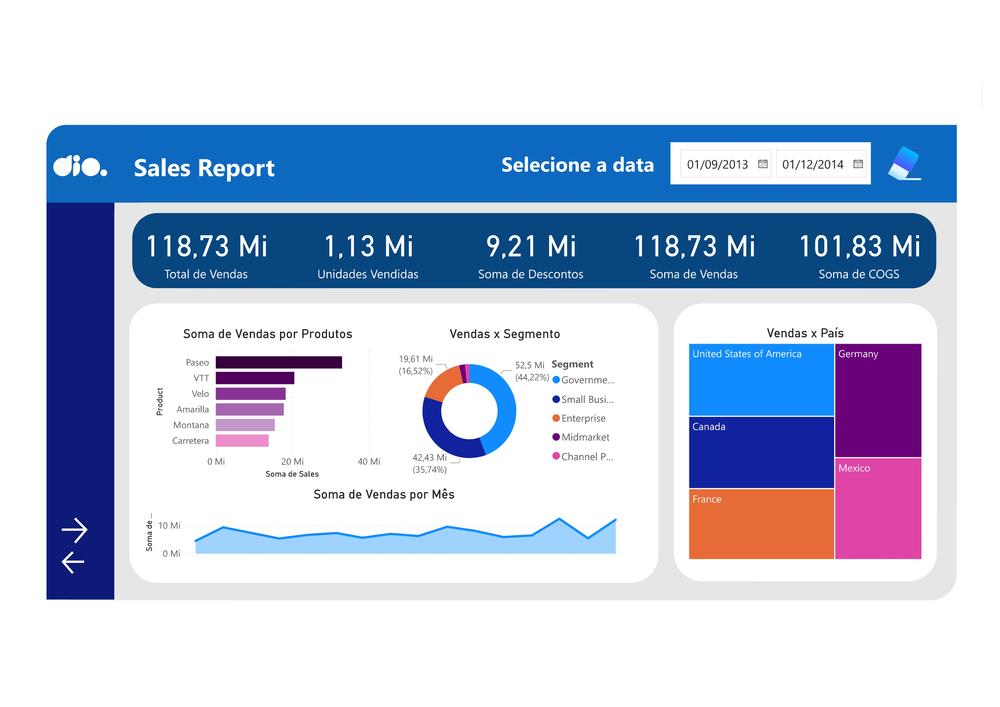
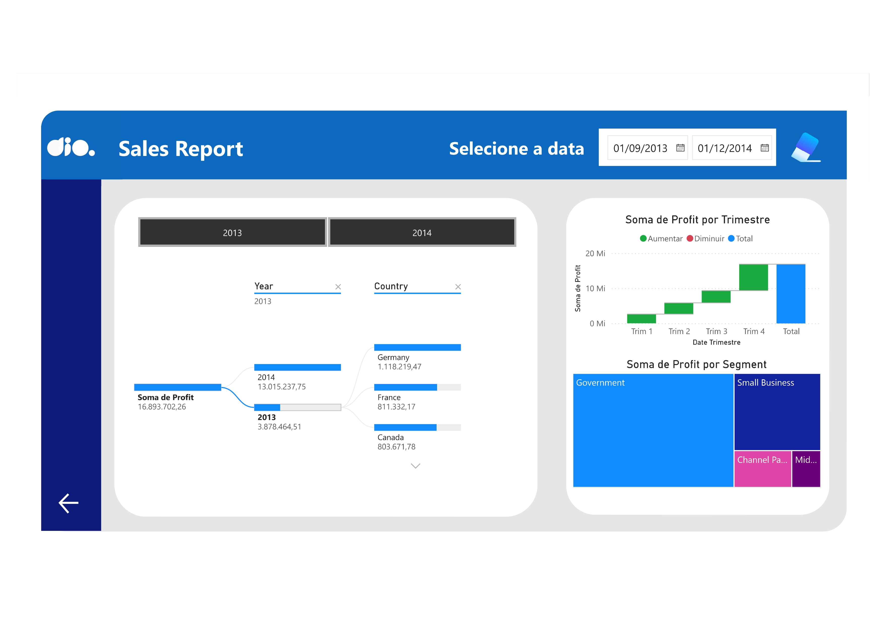

 
# NTT-DATA Bootcamp: Projetos e Desafios

### Sobre

Este repositório reúne os projetos e desafios desenvolvidos no bootcamp **NTT Data**, focando em **Python avançado**, **modelagem de dados**, **tratamento de dados** e **criação de dashboards** com **Power BI**. Já domino **Python** há bastante tempo e, embora já conhecesse **Power BI**, o curso me permitiu aprimorar habilidades em **DAX**, **criação de medidas e grupos**, e explorar profundamente o **esquema estrela (Star Schema)**. Essa experiência resultou em relatórios mais profissionais e robustos, com uma compreensão mais completa das melhores práticas em modelagem de dados.

### Resultado dos desafios

  
#### 1. Modelagem de Dados com Esquema Estrela

#### 2. Modelagem de Dados com DAX

#### 3. Melhorias no Design de Dashboard Gerencial

#### 4. Relatório de Vendas e Lucros com Power BI

