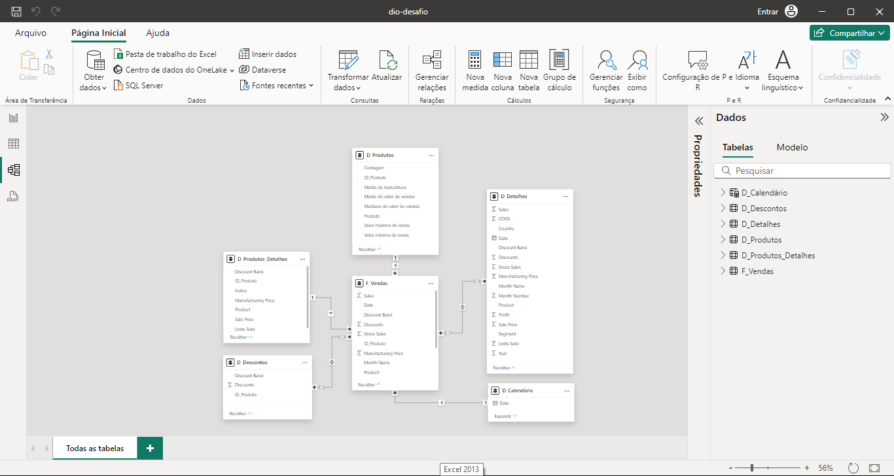
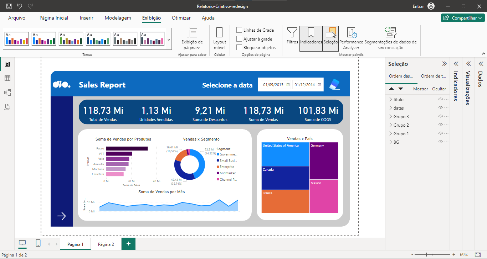
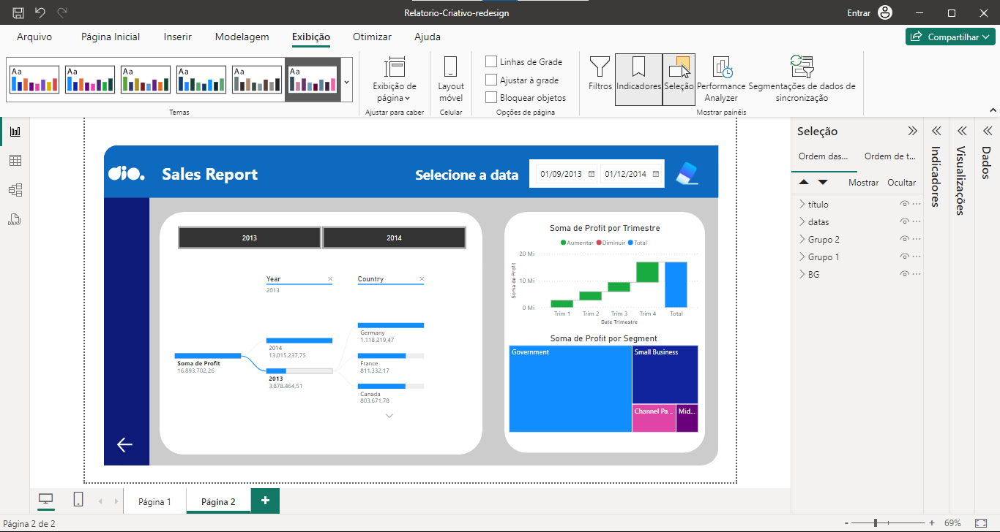
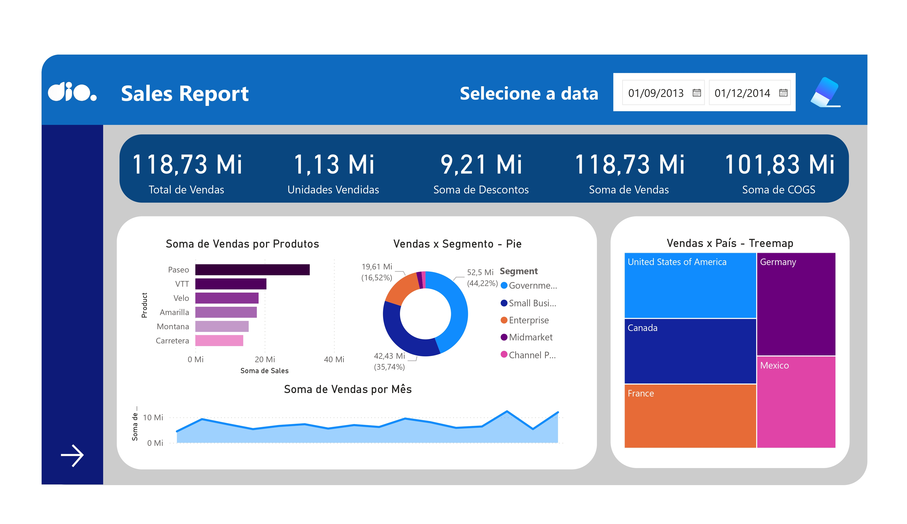
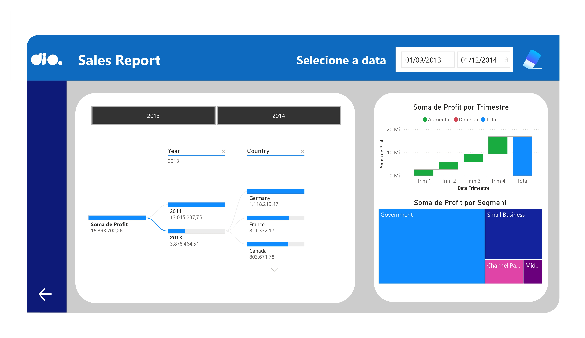

 
# NTT-DATA
### Sobre
Repositório central de todos os projetos e desafios desenvolvidos durante o bootcamp NTT Data. Ele serve como um espaço para acompanhar meu progresso e aprendizado ao longo do curso, destacando habilidades práticas em tratamento de dados e criação de dashboards no Power BI, conforme aplicado na NTT Data. Este portfólio reflete o avanço contínuo e a aplicação dos conhecimentos adquiridos, oferecendo uma visão clara do meu desenvolvimento.

### Resultado dos desafios

