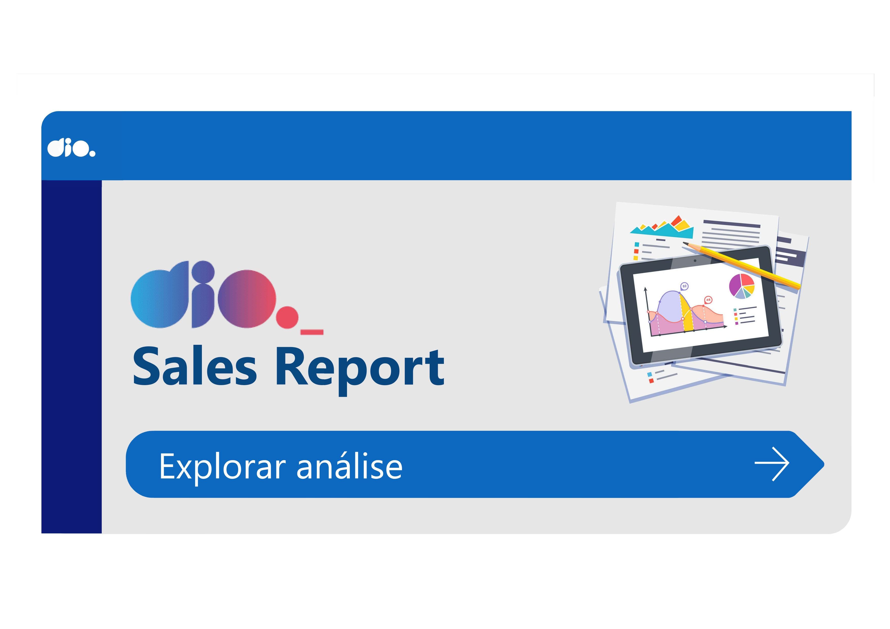

# NTT-DATA Desafio: Sales-Profit-Analytics-Report

### Sobre o projeto

Este desafio faz parte do bootcamp **NTT-Data** e tem como objetivo criar um relatório de **Vendas e Lucros** com foco em **Data Analytics** utilizando Power BI. O projeto passou por melhorias no design, como a adição de uma **homepage** para introduzir as análises, ajustes na cor de fundo, e a finalização do **controle de páginas**, resultando em um relatório mais profissional e visualmente equilibrado.

### Resultado

